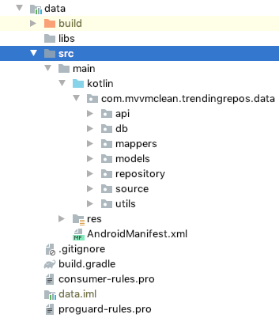
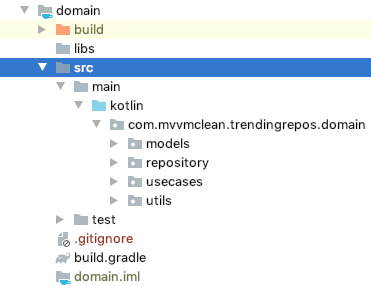
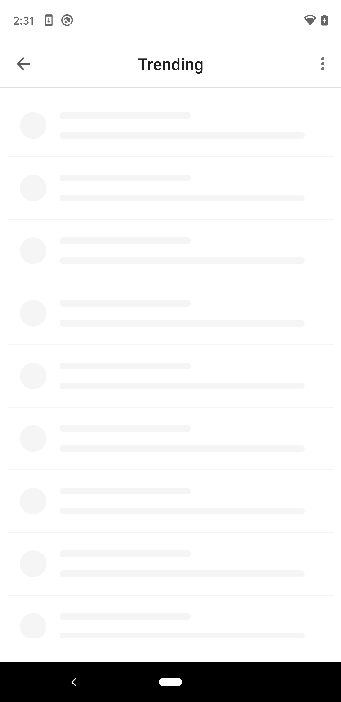
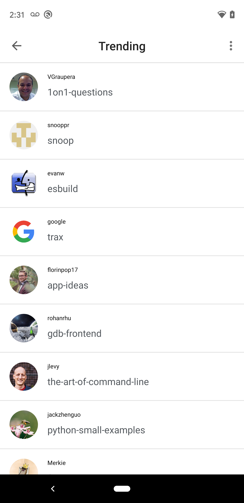
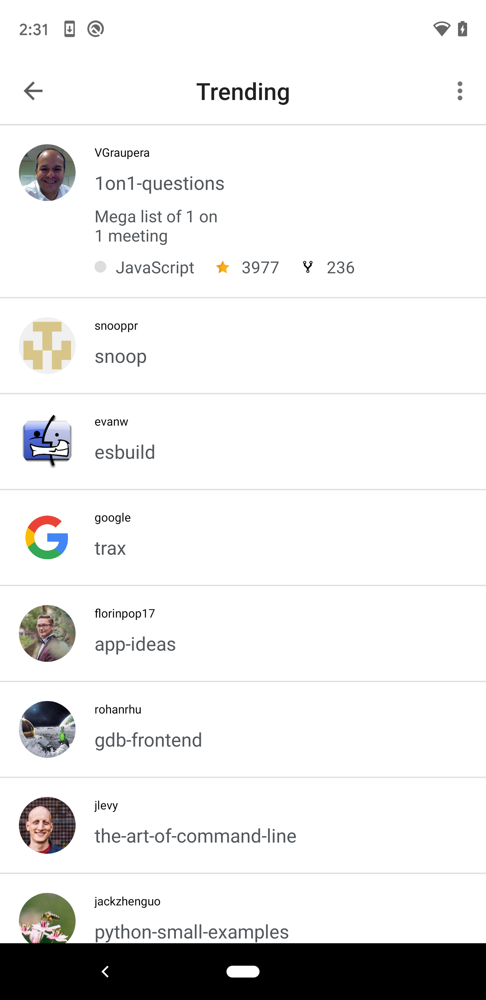
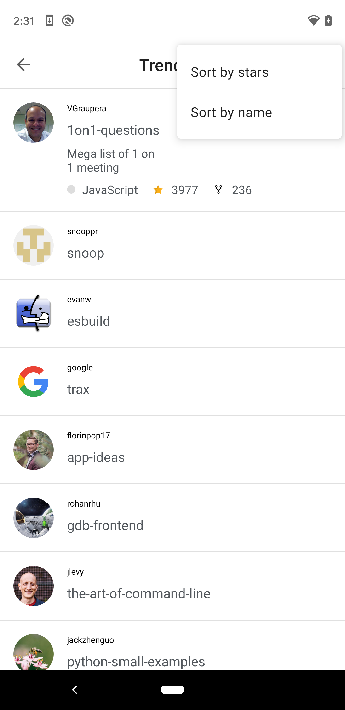
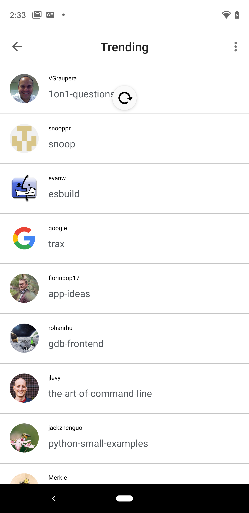

# Github Trending Repositories [Gojek]

An Android app consuming [GitHub Trending API](https://githubtrendingapi.docs.apiary.io/#reference/0/repositories/list-trending-repositories) to display the current trending
Github repositories. It has been built using kotlin with clean architecture principles, Repository Pattern and MVVM
pattern as well as Architecture Components.

Min API Level Supported : 19

## Prerequisite

Before running the project check your gradle version matches the required.
```
package-name: com.gojek.trendingrepos
```
    compileSdkVersion = 29
    targetSdkVersion = 29
    minSdkVersion = 19
    buildToolsVersion = "29.0.2"
    
## Development Environment

    Android Studio 3.5
    Build #AI-191.8026.42.35.5791312, built on August 9, 2019
    JRE: 1.8.0_202-release-1483-b49-5587405 x86_64
    JVM: OpenJDK 64-Bit Server VM by JetBrains s.r.o
    macOS Mojave 10.14

## Table of Contents

- [Architecture Blueprint](#architecture)
- [App Features](#appfeatures)
- [Libraries](#libraries)
- [Extras](#extras)
- [Screenshots](#screenshots)

## Architecture

The Application is split into a three layer architecture inorder to provide clean separation of concerns - making the code easier to navigate and maintain.
- Data - Layer that holds APIs, Database, Cache
- Domain - Layer that holds Use Cases, and Model Objects. Business logic happens here.
- Application - Layer that holds presentation, Android components, Viewmodels, Dagger components/modules handles Dependency Injection, etc. MVVM exists at this layer.


The three layered architectural approach is majorly guided by clean architecture which provides
a clear separation of concerns with its Abstraction Principle.

## App Features
 
 - Trending Repository Listing
 - Repository sorting by stars and name
 - Take user to corresponding repository on long press
 - Pull to refresh repository
 - Offline Storage ( Scheduled repo remote controller syncing, App will sync with backend server in every 2hrs )
 
## Libraries

Following are the Libraries used:

- [Material Design](https://material.io/develop/android/docs/getting-started/) - Google material design UIs.
- [Dagger2](https://github.com/google/dagger) - Dependency Injection lib with large community support.
- [Retrofit](https://square.github.io/retrofit/) - Network Http Client 
- [Jetpack](https://developer.android.com/jetpack)
  - [Viewmodel](https://developer.android.com/topic/libraries/architecture/viewmodel) - Channel between use cases and UI
  - [Data Binding](https://developer.android.com/topic/libraries/data-binding) - For binding of UI components in layouts to data sources, and coroutines support.  
- [Moshi](https://github.com/square/moshi) - Data, Model & Entity JSON Parser that understands Kotlin non-nullable and default parameters
- [okhttp-logging-interceptor](https://github.com/square/okhttp/blob/master/okhttp-logging-interceptor/README.md) - logs HTTP request and response data.
- [Mockito](https://site.mockito.org/) - Mocking framework used in unit tests.
- [kotlinx.coroutines](https://github.com/Kotlin/kotlinx.coroutines) - Library Support for coroutines, provides `runBlocking` coroutine builder used in tests
- [MockWebServer](https://github.com/square/okhttp/tree/master/mockwebserver) - web server for testing HTTP clients.
- [Leak Canary](https://square.github.io/leakcanary/) - Leak Detection Library
- [Espresso](https://developer.android.com/training/testing/espresso) - Test framework to write UI Tests
- [recyclerview-animators](https://github.com/wasabeef/recyclerview-animators) - Recycler View Animations
- [Room Persistence Library](https://developer.android.com/topic/libraries/architecture/room) - Robust database access while harnessing the full power of SQLite

## Extras

#### Gradle Dependencies

- dependencies.gradle - Centralized versioning of gradle dependencies in a global file
- Version.properties - App version details

App version details

#### Resource Values

- Fonts
- Dimension & String Values
- Themes & Styles
- Network Config

## Screenshots

- Architecure





- App Screens








## Demo

[Demo Video](https://www.dropbox.com/s/kme79skgurv6a9v/media.io_app-demo.mp4?dl=0) 

## License

 ```
   Copyright 2020 Anoop M Maddasseri
   
   Licensed under the Apache License, Version 2.0 (the "License");
   you may not use this file except in compliance with the License.
   You may obtain a copy of the License at

       http://www.apache.org/licenses/LICENSE-2.0

   Unless required by applicable law or agreed to in writing, software
   distributed under the License is distributed on an "AS IS" BASIS,
   WITHOUT WARRANTIES OR CONDITIONS OF ANY KIND, either express or implied.
   See the License for the specific language governing permissions and
   limitations under the License.
 ```


